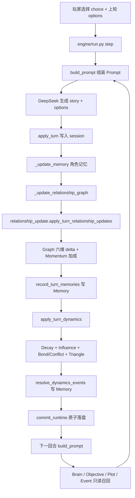

# V5.1 Review B — Narrative Loop Audit

**日期**: 2026-06-08  
**结论**: PASS（闭环已形成，见下图与链路表）

---

## 叙事循环（真实运行链路）

---

## 分阶段代码锚点

### 1. 玩家行为 → Relationship Update

| 步骤 | 文件 | 函数 |
|---|---|---|
| 回合入口 | `engine/run.py` | `step()` → `_update_relationship_graph()` |
| 选项 delta 解析 | `engine/relationship_update.py` | `parse_option_metric_deltas` |
| 剧情 trust 启发 | `engine/memory.py` | `guess_trust_delta_from_story` |
| Momentum 加成 | `engine/relationship_update.py` | `_apply_delta_with_momentum` |
| 图更新 | `engine/relationship_core.py` | `apply_metric_delta`, `set_edge` |

### 2. Memory Event

| 步骤 | 文件 | 函数 |
|---|---|---|
| 快照对比 | `engine/relationship_memory.py` | `record_turn_memories` |
| 规则生成 type/summary | `engine/relationship_memory.py` | `_infer_type_and_summary` |
| Bond 升级事件 | `engine/relationship_event_resolver.py` | `resolve_dynamics_events` |

### 3. Dynamics

| 步骤 | 文件 | 函数 |
|---|---|---|
| 编排 | `engine/relationship_dynamics.py` | `apply_turn_dynamics` |
| 衰减 | `engine/relationship_decay.py` | `apply_relationship_decay` |
| 一层传播 | `engine/relationship_influence.py` | `apply_relationship_influence` |
| 三角检测 | `engine/relationship_event_resolver.py` | `detect_relationship_triangles` |

### 4. Brain / Objective / Plot Director 读取

| 消费者 | API | 注入位置 |
|---|---|---|
| Character Brain | `read_api_for_brain` | `{{CHARACTER_BRAIN}}` |
| Objective | `read_api_for_objective` + `read_api_for_objective_text` | `{{OBJECTIVES_CONTEXT}}` |
| Plot Director | `read_api_for_plot` + `build_relationship_tension_context` | `{{DIRECTOR_ADVICE}}` |
| Event Director | `build_relationship_event_candidates` | `{{FORCE_EVENT_PROMPT}}` 附属块 |

### 5. Prompt → 新剧情 → 再影响 Relationship

| 步骤 | 文件 | 说明 |
|---|---|---|
| 模板占位 | `prompt_template.yaml` | `RELATIONSHIP_SYSTEM`, `RELATIONSHIP_MEMORY_CONTEXT`, `RELATIONSHIP_DYNAMICS_CONTEXT` |
| 构建 | `engine/builder.py` | `_build_prompt_unified` |
| 生成 | `engine/run.py` | `build_prompt` → DeepSeek |
| AI 输出 options 含 metric 提示 | `prompt_template.yaml` | `affection+3 trust-1` 等 |
| 下回合回到步骤 1 | `relationship_update` | 解析 options 再次 delta |

---

## 闭环验证点

| 链路环节 | 是否接线 | 证据 |
|---|---|---|
| 玩家 → Update | ✅ | `run.py` L820-851 |
| Update → Memory | ✅ | `record_turn_memories` |
| Update → Dynamics | ✅ | `apply_turn_dynamics` |
| Dynamics → Memory | ✅ | `resolve_dynamics_events` |
| 召回 → Brain | ✅ | `character_brain.py` L192-203 |
| 召回 → Objective | ✅ | `objective_system.py` L289-323 |
| 召回 → Plot | ✅ | `plot_director.py` L143-163 |
| 召回 → Prompt | ✅ | `builder.py` L166-189 |
| Prompt → 新剧情 | ✅ | `run.py` `step()` 全链 |
| 新剧情 → Relationship | ✅ | options/story 解析回写 Graph |

---

## 已知非闭环项（设计边界）

- **UI 不回写**：无 Relationship Dashboard；玩家仅通过选项/剧情间接影响（符合 V5.1 范围）。
- **AI 不直接写 Graph**：关系数值由引擎解析 options/story，非 LLM 自由输出 JSON（防 Prompt 涌现回归）。

---

## Review B 判定

**PASS** — Graph → Memory → Dynamics → Directors → Prompt → 剧情 → Update 闭环完整。
